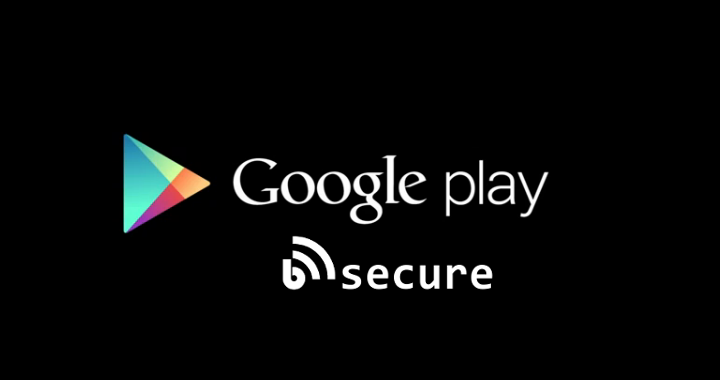

Frontend-Bsecure-Android-
========

## NOW ON GOOGLE PLAY

Bsecure Android app 
* version: 1.0
* Final project of the course "Grado en Ingenería Informática", Universidad de La Laguna.
* Playstore link: [Bsecure](https://play.google.com/store/apps/details?id=com.tfg.sawan.bsecure)

## [Colaborators](https://github.com/alu0100694765/frontend-Bsecure-Android/graphs/contributors)
Sawan Jagdish Kapai Harpalani. Contact: <alu0100694765@ull.edu.es>

## [License](http://www.gnu.org/licenses/gpl-3.0.html) 
This project is under GNU license.

## Project Description.
Bsecure is a project design to track people who are on a excursion or a hiking trip and have got lost. On the other hand it has also been created for viewing health information of the subject that carries the Beacon. Going into detail of the previous idea, if some user finds another user in an emergency state he or she can view the profile of that user and perfom according to it.

## Android SDK
The Android software development kit (SDK) includes a comprehensive set of development tools. These include a debugger, libraries, a handset emulator based on QEMU, documentation, sample code, and tutorials. Currently supported development platforms include computers running Linux (any modern desktop Linux distribution), Mac OS X 10.5.8 or later, and Windows XP or later. As of March 2015, the SDK is not available on Android itself, but the software development is possible by using specialized Android applications.

